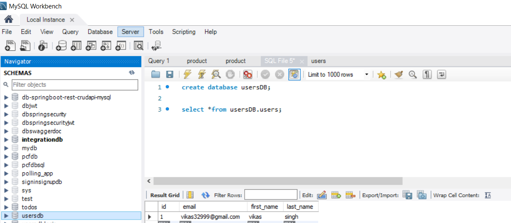
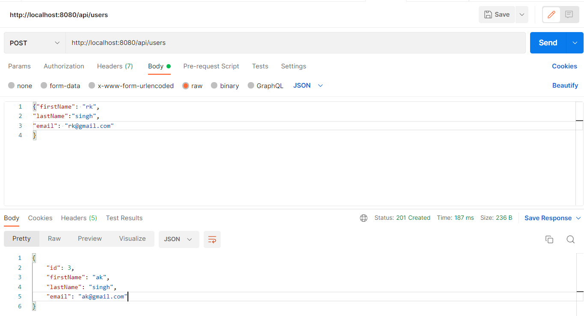
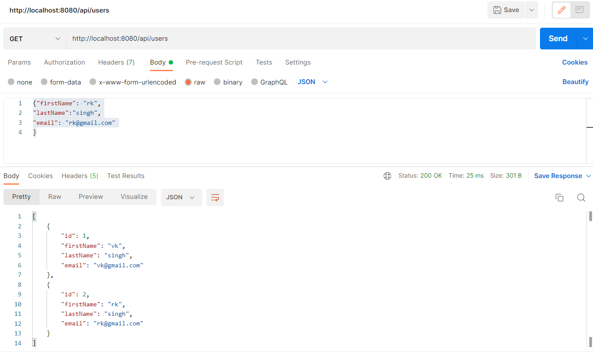
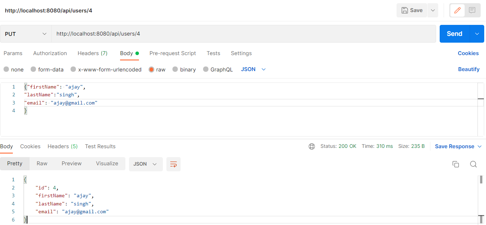
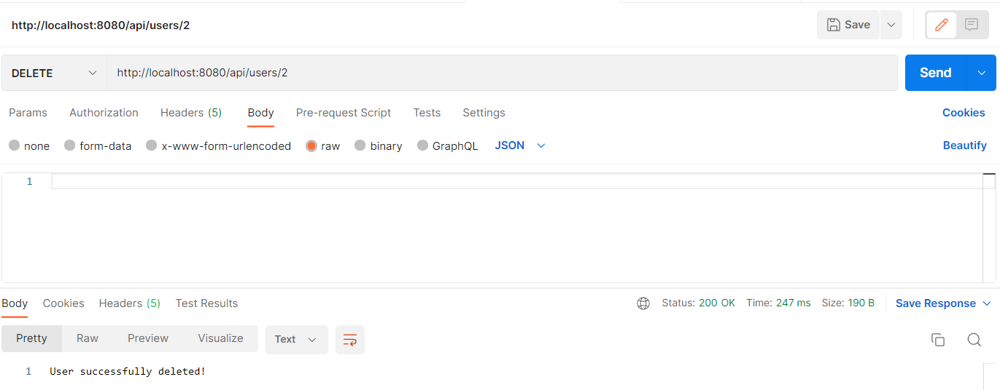
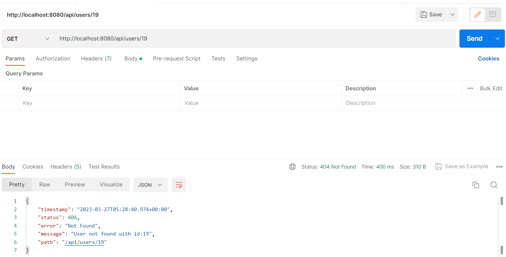
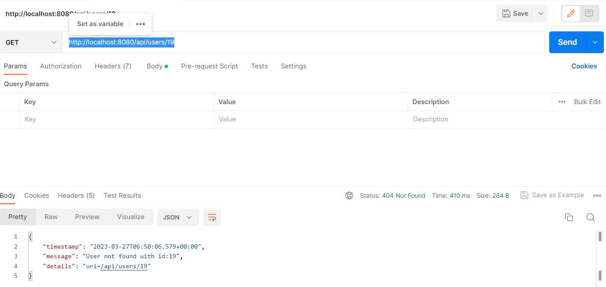

## Test Spring Boot CRUD REST APIs using Postman Client
### Spring Boot REST API CRUD+Exception Handling(used Spring Boot 3+Lombok+Spring Data JPA+MySQL Database.)
### Create Database schema My Sql Workbench

### Create User REST API:

http://localhost:8080/api/users

### Get All Users REST API:
http://localhost:8080/api/users

### Get Single User REST API:
http://localhost:8080/api/users/1

### Update User REST API:
http://localhost:8080/api/users/4

### Delete User REST API:
http://localhost:8080/api/users/1

### Exception Handling
###### Note:when using devtools stack trace comes default for disable remove devtools dependenceies or use server.error.include-stacktrace=never in propertes files
###### if user not found then getting customized exception,here user id not avilabel in Databases (boot specfic exception)
http://localhost:8080/api/users/19

### Custom Exception(global exceptions,specfic exceptions)
http://localhost:8080/api/users/19

